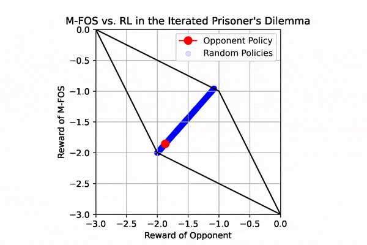

## Model-Free-Opponent Shaping

#### In ICML 2022 (Spotlight) [[ArXiv]](https://arxiv.org/abs/2205.01447)

[Chris Lu](https://chrislu.page/), [Timon Willi](https://www.timonwilli.com/), [Christian Schroeder de Witt](https://www.schroederdewitt.com/), [Jakob Foerster](https://www.jakobfoerster.com/)

Work done at [FLAIR](https://foersterlab.com/).



This is a [PyTorch](https://pytorch.org/) based implementation of our ICML 2022 paper [Model-Free Opponent Shaping](https://arxiv.org/abs/2205.01447). We introduce a new meta-game approach to general-sum games that learns to influence or "shape" the long-term evolution of its opponent's policy.  

```
@inproceedings{lu2022mfos,
  Author    = {Chris Lu and
               Timon Willi and
               Christian A. Schroeder de Witt and
               Jakob N. Foerster},
  title     = {Model-Free Opponent Shaping},
  booktitle = {International Conference on Machine Learning, {ICML} 2022, 17-23 July
               2022, Baltimore, Maryland, {USA}},
  series    = {Proceedings of Machine Learning Research},
  volume    = {162},
  pages     = {14398--14411},
  publisher = {{PMLR}},
  year      = {2022},
}
```

### 1) Setup and Usage

1.  This code is based on [PyTorch](https://pytorch.org/). To install and setup the code, run the following commands:
  ```Shell
  git clone https://github.com/luchris429/Model-Free-Opponent-Shaping.git
  
  #create virtual env
  conda create --name mfos python=3.5
  source activate mfos

  #install requirements
  pip install numpy
  pip install torch
  ```


2. Training standard M-FOS against Naive Learner in the IPD
  ```Shell
  cd Model-Free-Opponent-Shaping
  # name of the experiment
  python3 src/main_mfos_ppo.py --game=IPD --opponent=NL --exp-name=runs/mfos_ppo_ipd_nl
  ```


### 2) Acknowledgements
We used the PPO implementation from: https://github.com/nikhilbarhate99/PPO-PyTorch

We used environment and opponent code from: https://github.com/aletcher/impossibility-global-convergence
